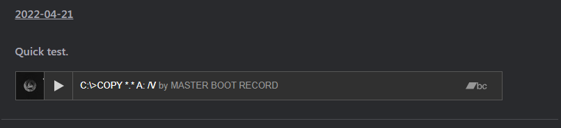

# Bandcamp

Adds a Bandcamp short code to Micro.blog.

---

Usage:

```

```
---

Example Post:



---

Details for Nerds:

To get the ID of a Bandcamp album you can run `TralbumData.id` in the JavaScript console from the Bandcamp album page.